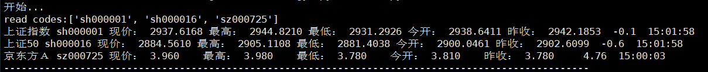

# 交易助手
设置需关注的股票代码，自动更新股票最新价格



#### 用法

1.在```/data/hold_stock_codes.txt```文件加入股票代码，比如：
```
sh000001
sh000016
```
2.在项目根目录执行：
```python
python main.py
```
即可。

3.退出在主界面按```q```。

# todo

- 添加持仓盈亏
- 添加5日均线
- 添加板块涨跌
